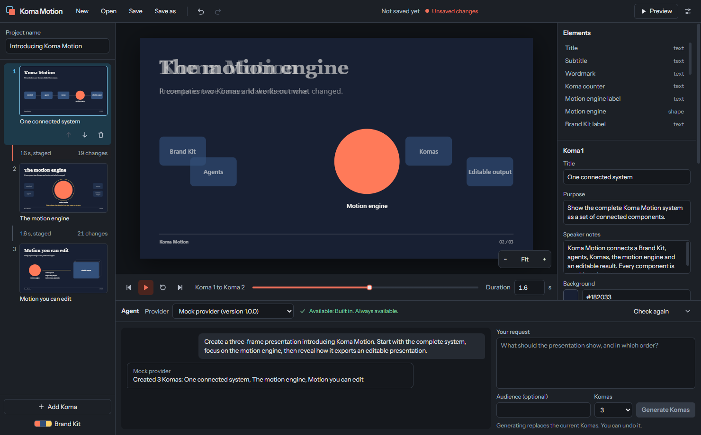
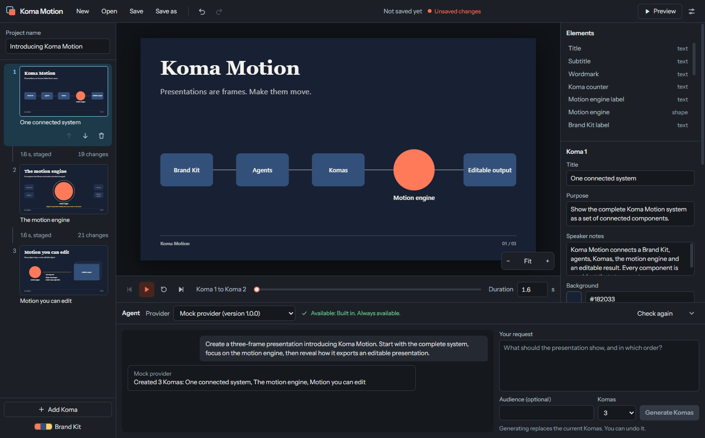
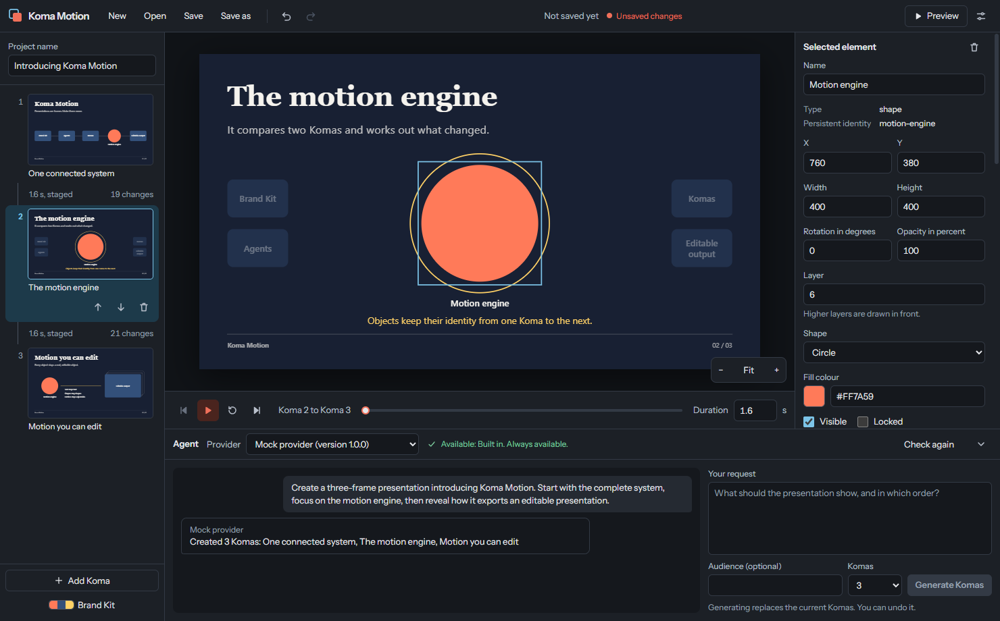
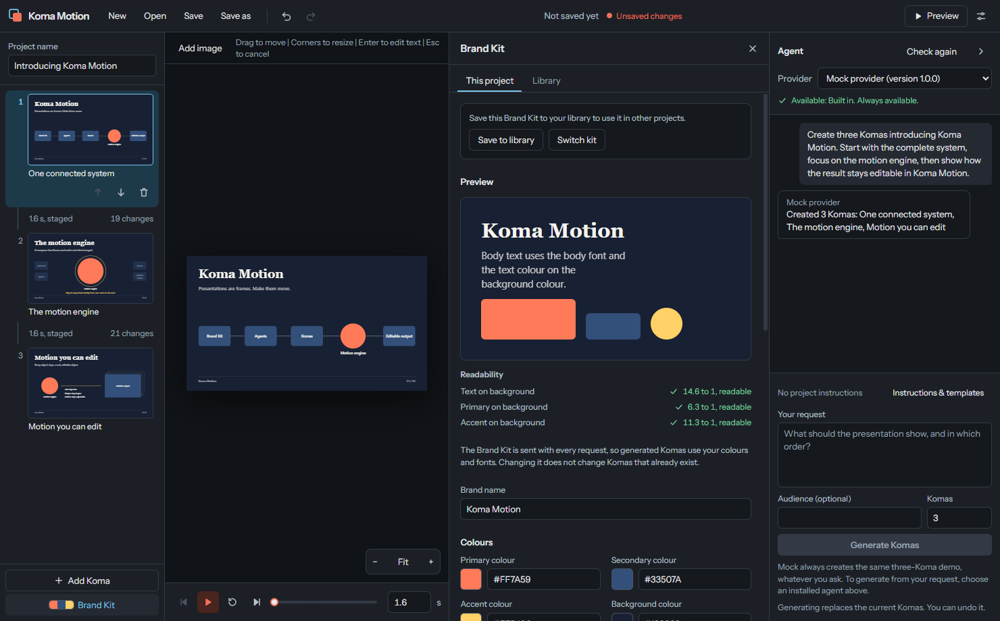
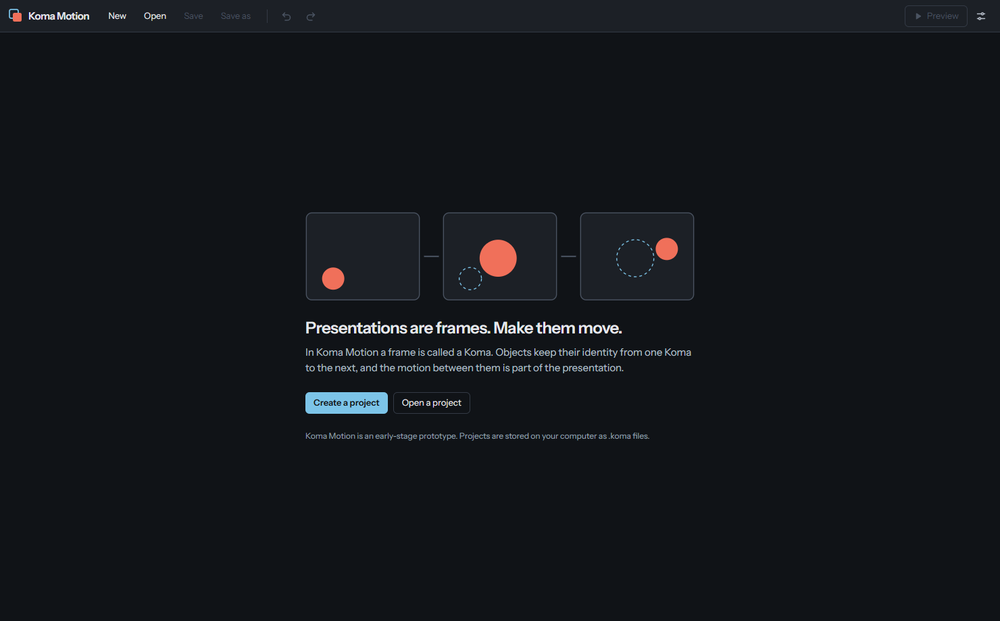

# Koma Motion

**Presentations are frames. Make them move.**

An experimental open-source AI-native presentation motion studio.

[](https://github.com/Dytschgo/koma-motion/actions/workflows/ci.yml)
[](LICENSE)

> **Koma Motion is an early-stage prototype.** It proves one idea: motion
> that is derived from the identity of objects. It cannot export to
> PowerPoint, its installers are not signed, and its file format can still
> change.

## Download

| Platform | Download                                                                                                        |
| -------- | --------------------------------------------------------------------------------------------------------------- |
| Windows  | [Koma-Motion-Setup.exe](https://github.com/Dytschgo/koma-motion/releases/latest/download/Koma-Motion-Setup.exe) |
| macOS    | [Koma-Motion.dmg](https://github.com/Dytschgo/koma-motion/releases/latest/download/Koma-Motion.dmg)             |

The installers are not signed, so Windows and macOS warn when you open them.
[docs/RELEASES.md](docs/RELEASES.md#installing) explains how to install and
how to switch to nightly previews.



## What is Koma Motion?

Koma Motion is a desktop application for macOS and Windows in which you
describe a presentation in a chat and an AI agent designs it. The
application then works out how every object moves from one frame to the next.

Koma Motion does not run AI models itself. It uses agent programs that are
installed on your computer, such as Claude Code, and it contains a mock
provider that works without any AI service.

## Why Komas instead of isolated slides?

Presentation tools treat a slide as a page. What is on one page has nothing
to do with what is on the next, so motion between pages is a generic effect
that is added afterwards.

In Koma Motion a frame is called a **Koma**, the word animators use for a
single frame. A Koma is a visual state. An object that appears in two Komas
is the same object in two states, so the step between them is a change that
can be played: the object moves, grows, turns or changes colour.

## Core concept

```text
Prompt -> Story -> Komas -> Motion between Komas -> Editable presentation
```

Every element has a **persistent identity**:

```text
Koma 1   "motion-engine"   small circle on the right
Koma 2   "motion-engine"   large circle in the centre
```

The motion engine compares the two Komas and finds one retained object that
changes position and size. Objects that exist only in the second Koma enter,
objects that exist only in the first Koma exit. The agent suggests how the
transition should feel and explains why. The motion itself is computed by
the application and is the same every time.

## Current project status

Early-stage prototype. The first milestone, a vertical slice from the chat
to a saved file, is complete.

| Platform | State                                                                                |
| -------- | ------------------------------------------------------------------------------------ |
| Windows  | developed and tested on Windows 11; checked in CI                                    |
| macOS    | checked in CI, including tests that run the application; not tested by hand on a Mac |
| Linux    | not supported                                                                        |

## Current capabilities

Everything in this list is implemented and covered by automated tests.

- Create a project, open a project, save and save as (`.koma` files).
- Edit a Brand Kit with colours, fonts, a logo and descriptions, with a live
  preview and readability checks.
- Describe a presentation in the chat and choose a provider.
- Generate three Komas with the built-in mock provider, without network and
  without an API key.
- Generate Komas with Claude Code. Tested on Windows.
- See the Komas and the in-betweens that connect them.
- Select Komas and elements and edit their properties.
- Add, copy, reorder and delete Komas.
- Preview the transition between two Komas: play, pause, restart, move to
  any position, change the duration.
- Undo and redo every change.
- Cancel a running generation.

## Screenshots

| Generated Komas                                    | Inspecting an element                        |
| -------------------------------------------------- | -------------------------------------------- |
|  |  |

| Brand Kit                                           | Start                                         |
| --------------------------------------------------- | --------------------------------------------- |
|  |  |

The screenshots are created from the running application with
`KOMA_SCREENSHOTS=1 pnpm test:e2e screenshots`.

## Key features

| Feature                      | State                                          |
| ---------------------------- | ---------------------------------------------- |
| Persistent object identity   | available                                      |
| Deterministic motion engine  | available                                      |
| Transition preview           | available                                      |
| Brand Kit                    | available                                      |
| Mock provider                | available                                      |
| Claude Code provider         | available, tested on Windows                   |
| Codex CLI provider           | experimental, generation has never been tested |
| Undo and redo                | available                                      |
| Editing on the canvas        | not available, elements are edited in a panel  |
| Playing a whole presentation | not available, one transition at a time        |
| PowerPoint export            | **not available**                              |
| Stop Motion Mode             | not available, concept only                    |
| Installers                   | available for Windows and macOS, not signed    |
| Stable and nightly updates   | available; installed by the app on Windows     |
| `koma` command line tool     | not available, the name is reserved            |

## Architecture overview

```text
apps/desktop            the Electron application
packages/core           the document model
packages/brand-kit      Brand Kit logic
packages/project-format reading and writing .koma files
packages/motion-engine  motion between Komas
packages/agent-runtime  agent providers
packages/renderer       drawing Komas with React
packages/exporters      exporter interface and placeholder
```

The document model depends on nothing but a schema library. The renderer,
the agent providers and the exporters read the model and cannot change its
shape. The user interface runs in a sandboxed window without access to
files or processes.

Read more in [ARCHITECTURE.md](ARCHITECTURE.md).

## Brand Kits

A Brand Kit holds the brand name, five colours (primary, secondary, accent,
background, text), a heading font and a body font, a logo, and descriptions
of tone, visual style, icon style, imagery, topics and notes.

The Brand Kit is structured data. It is part of every generation request,
and generated Komas use its colours and fonts. Colours are stored in one
format, `#RRGGBB`, and are validated before they are stored.

Changing the Brand Kit does not change Komas that already exist.

## Motion model

- Komas are laid out on a fixed logical canvas of 1920 x 1080 units (16:9) or
  1440 x 1080 units (4:3).
- Element types: text, shape (rectangle, rounded rectangle, circle, line),
  image and group.
- Operations: hold, move, scale, rotate, fade in, fade out, colour change and
  replace.
- Strategies: continuous, or staged (objects leave, then change, then enter).
- When the operating system asks for reduced motion, previews cut from one
  Koma to the next instead of moving objects.

Read more in [docs/MOTION_MODEL.md](docs/MOTION_MODEL.md).

## Agent providers

| Provider        | Needs                                | State                                          |
| --------------- | ------------------------------------ | ---------------------------------------------- |
| Mock provider   | nothing                              | available                                      |
| Claude Code CLI | Claude Code, installed and signed in | tested on Windows with Claude Code 2.1.283     |
| Codex CLI       | Codex CLI, installed and signed in   | experimental, generation has never been tested |

Providers that use an agent CLI send your request and your Brand Kit to the
online service of that CLI. The application says so before you generate.
Koma Motion stores no API keys.

All agent output is treated as untrusted data: it is limited in size,
validated against a schema and checked for invalid references before it
becomes part of a project. It is never executed.

Read more in [docs/AGENT_PROVIDERS.md](docs/AGENT_PROVIDERS.md).

## Native `.koma` project format

A project is one human-readable JSON file with the extension `.koma`. It is
schema-versioned, validated when it is opened and when it is saved, and
written deterministically. Saving replaces the previous file as a whole. That
replacement is not a guarantee against power loss. Images are stored inside
the file.

Koma Motion refuses to open projects of a newer format version and never
overwrites them.

An example project is in
[examples/generated-with-claude-code.koma](examples/generated-with-claude-code.koma).
Read more in [docs/PROJECT_FORMAT.md](docs/PROJECT_FORMAT.md).

## Local development

Requirements:

- Node.js 22.12 or newer
- pnpm 11
- macOS or Windows

```sh
git clone https://github.com/Dytschgo/koma-motion.git
cd koma-motion
pnpm install
pnpm dev
```

`pnpm dev` builds the application, starts it, and rebuilds and restarts it
when a source file changes. There is no development server: development
runs with the same security settings as production.

Electron downloads its binary the first time it is started.

## Available scripts

| Script              | Purpose                                                 |
| ------------------- | ------------------------------------------------------- |
| `pnpm dev`          | run the application and restart it on changes           |
| `pnpm build`        | build the application into `apps/desktop/out`           |
| `pnpm start`        | start the built application                             |
| `pnpm lint`         | check the code with ESLint                              |
| `pnpm typecheck`    | check the types of all packages                         |
| `pnpm test`         | run the unit tests                                      |
| `pnpm test:watch`   | run the unit tests on every change                      |
| `pnpm test:e2e`     | run the application tests against the built application |
| `pnpm format`       | format all files with Prettier                          |
| `pnpm format:check` | check the formatting                                    |
| `pnpm check`        | lint, check types, test and build                       |

## Testing

```sh
pnpm test         # unit tests
pnpm build        # the application tests need a build
pnpm test:e2e     # application tests
```

- **Unit tests** cover the document model, the project format, the Brand
  Kit, the motion engine, the agent runtime, the providers, the exporters,
  the undo history and the security rules.
- **Application tests** start the built application and use it like a
  person: create a project, configure the Brand Kit, generate with the mock
  provider, inspect, preview, save and reopen.
- **Live tests** use the agent CLIs on your computer and your account. They
  only run when you ask for them. See
  [docs/AGENT_PROVIDERS.md](docs/AGENT_PROVIDERS.md#live-tests).

CI runs everything except the live tests on Windows and macOS.

## Building the desktop application

```sh
pnpm build
pnpm start
```

`pnpm build` creates three bundles in `apps/desktop/out`: the main process,
the preload script and the window. `pnpm start` runs them with Electron.

To create an installer from the source code:

```sh
pnpm package:win   # on Windows
pnpm package:mac   # on macOS
```

The installers are written to `apps/desktop/release`. They are not signed.
[docs/RELEASES.md](docs/RELEASES.md) describes how releases are published.

## Supported platforms

- Windows, tested on Windows 11
- macOS, tested in CI only

Linux is not supported. The code avoids choices that would make Linux
support difficult, but nothing is tested there.

## Security philosophy

- **Agent output is untrusted input.** It is data, and it is validated.
- **The window is untrusted.** It runs sandboxed, without Node.js, without
  files, without processes, and it cannot open its own network connections.
  A link to this repository can still open in the system browser.
- **The application uses the network for one purpose:** installed versions
  ask GitHub which versions of Koma Motion exist. Nothing about you or your
  projects is sent. Agent CLIs are separate programs with their own network
  use.
- **Privileged work happens in the main process**, behind a fixed set of
  validated channels.
- **Security is not weakened for development.**

Read more in [SECURITY.md](SECURITY.md). Please report vulnerabilities
privately, as described there.

## Known limitations

- PowerPoint export does not exist. No other export exists either.
- The Codex CLI provider has never generated a presentation.
- Claude Code has been tested on Windows only.
- Generation replaces the whole presentation. Single Komas cannot be changed
  through the chat.
- Elements cannot be dragged on the canvas or added by hand.
- Changes that cannot be interpolated, such as a change of text or font
  size, are cross-fades.
- Fonts must be installed on the computer.
- Images can only be added as the logo of the Brand Kit, up to 2 MB.
- The installers are not signed and not notarised. Windows and macOS warn
  when they are opened.
- On macOS the application cannot install updates. It opens the download
  page.
- Installing an update from one published version to the next has not been
  tested yet.
- The project format can change before version 1.0.

The complete list is in
[docs/IMPLEMENTATION_PLAN.md](docs/IMPLEMENTATION_PLAN.md).

## Roadmap

1. **Editing:** move and resize elements on the canvas, add elements, play a
   whole presentation.
2. **Agents:** verify Codex, verify both CLIs on macOS, change single Komas,
   reference files.
3. **Export:** research and prototype an editable PowerPoint export.
4. **Distribution:** packaged projects, installers, signing.
5. **Research:** Stop Motion Mode and more kinds of motion.

The [issues](https://github.com/Dytschgo/koma-motion/issues) contain the
details.

## Contributing

Contributions are welcome. Please read [CONTRIBUTING.md](CONTRIBUTING.md) and
the [Code of Conduct](CODE_OF_CONDUCT.md) first.

## Licence

[MIT](LICENSE)
