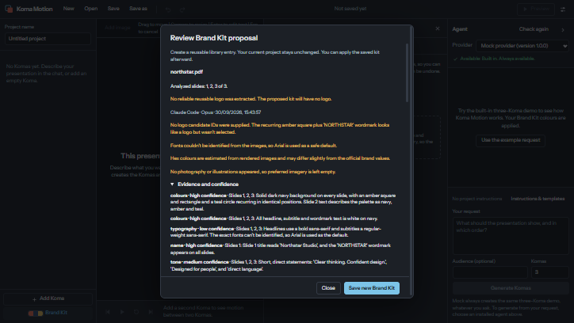
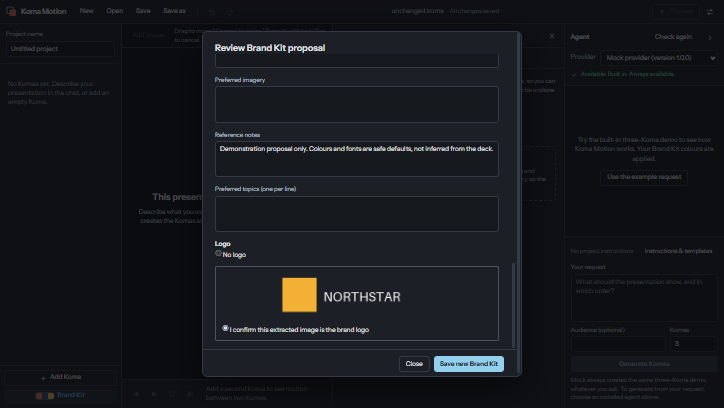

# Brand Kit from deck: Windows verification

Verified on 30 September 2026 against implementation commit
`acaeacb9a3800c56debb2199b5d868385888c209`. The checkout was clean for the final
Electron runs. This evidence commit adds documentation and captures only.

The feature branch is `feat/brand-kit-from-deck`, based on `main` at
`1f27be74406df577b331168385012cb5a91846c2`. The reusable Brand Kit library
dependency, [PR #42](https://github.com/Dytschgo/koma-motion/pull/42), is already
merged into that base. This is not a stacked PR. The separate, dirty original
workspace was left untouched.

## Environment

- Windows build 26200; Node 24.18.0; pnpm 11.25.0.
- Built Electron application launched through the repository's isolated-profile
  Playwright harness. Native file-picker responses were stubbed; the actual
  preload, IPC, renderers, local processors, files and library persistence ran.
- LibreOffice 26.8.0.3, locally extracted from the official Windows MSI and
  selected with `KOMA_LIBREOFFICE_EXECUTABLE`. No system installation change.
- Bundled PDF.js 6.3.289.
- Installed Claude Code 2.1.285 with the existing authenticated Claude account.
  No new credential or external processing service was configured.
- Requested model: `opus`. The final focused protocol probe reported
  **`claude-opus-5-5`**. The alias can change; saved provenance records the alias.
- Mock capture geometry: native window 1480 × 920, initial renderer viewport
  1448 × 842, device scale factor 0.5, reduced motion false. See
  [recorded environment](pptx-environment.json). Screenshots use the existing
  harness's half-scale setting; the live run used that same harness setting.

Only checked-in synthetic Northstar fixtures were used. The live analysis
received three locally rendered slide PNGs and extracted text from
`northstar.pdf`. Neither its original PDF nor a current project was supplied
to Claude. The separate protocol probe used one synthetic PNG. Mock results
are demonstration values and are not evidence of model perception.

## Checks and outcomes

| Command                                                                                                                                 | Result                                                          |
| --------------------------------------------------------------------------------------------------------------------------------------- | --------------------------------------------------------------- |
| `pnpm lint`                                                                                                                             | Passed                                                          |
| `pnpm typecheck`                                                                                                                        | Passed                                                          |
| `pnpm format:check`                                                                                                                     | Passed                                                          |
| `pnpm test`                                                                                                                             | 716 passed, 6 opt-in live tests skipped; 13 script tests passed |
| `pnpm build`                                                                                                                            | Passed; PDF.js produces a large-chunk advisory                  |
| `pnpm --filter @koma-motion/desktop exec playwright test deckBrandKit.spec.ts brandKitLibrary.spec.ts workflow.spec.ts --reporter=list` | 22 passed, none skipped, 44.2 seconds                           |
| `pnpm --filter @koma-motion/desktop exec playwright test deckBrandKit.live.spec.ts --reporter=list`                                     | 1 passed, 15.8 seconds                                          |
| `pnpm exec vitest run packages/agent-runtime/src/node/claudeBrandKitAnalysis.live.test.ts --reporter=verbose --silent=false`            | 1 passed, 10.43 seconds; resolved model `claude-opus-5-5`       |

The mock application command used the trusted local LibreOffice executable
environment variable and no `KOMA_LIVE_*` variables. The live Electron command
ran separately with `KOMA_LIVE_DECK_ANALYSIS=1`; the focused probe ran separately
with `KOMA_LIVE_DECK_PROBE=1`. Neither is enabled in ordinary tests or CI.

Unit coverage includes malformed and oversized archives, encrypted input,
unsafe XML/media/relationships, strict response and logo-ID validation,
provider failures, cancellation and late replies, temporary cleanup, and
library asset rollback after persistence failure. The Electron suite checks:

- Local PDF and actual LibreOffice PPTX preparation, text and previews.
- Review edits, explicit logo confirmation and reusable asset storage.
- Byte-identical saved project and clean project state after library save;
  a changed project only after explicit Apply.
- Cancellation without a saved partial kit, failed library save preserving
  edits, and successful retry.
- Encrypted and invalid PDFs, a 201-page rejection, and exact disclosure of
  the 20 selected slides from a 25-page document.
- Normal shutdown during LibreOffice conversion, with no remaining session
  temporary directory.
- Existing Brand Kit library operations and project workflow/security checks.

The live proposal identified navy, amber, teal and white, cited observed
layouts and slide text, used safe Arial defaults with low-confidence font
notes, and warned that no reusable PDF logo was supplied. See the
[captured review text](live-review.txt). The live test also saved the validated
proposal into its isolated library profile.

## Captures

| State                            | Evidence                                                                          |
| -------------------------------- | --------------------------------------------------------------------------------- |
| Choose deck/provider             | [PPTX upload](pptx-01-upload.png)                                                 |
| Local preparation and disclosure | [PPTX prepared](pptx-02-prepared.png), [PDF prepared](pdf-02-prepared.png)        |
| Analysis progress                | [Mock progress](pptx-03-progress.png), [live Opus progress](live-02-progress.png) |
| Review and edit                  | [Edited mock proposal](pptx-04-review.png), [live proposal](live-03-review.png)   |
| Confirm extracted logo           | [PPTX logo confirmation](pptx-04-logo.png)                                        |
| Save reusable entry              | [Mock save](pptx-05-saved.png), [live save](live-04-saved.png)                    |
| Explicitly apply to project      | [Apply](pptx-06-applied.png)                                                      |
| Live provider disclosure         | [Claude Code / Opus disclosure](live-01-disclosure.png)                           |

## Remaining coverage and limitations

macOS local rendering, LibreOffice conversion, CLI input and packaged builds
were not exercised. Windows packaged installation and actual OS file-picker
interaction were not exercised. Do not claim platform-wide release validation.
The live end-to-end run used PDF; PPTX conversion/logo handling ran with the
mock provider, and both use the same prepared-image provider contract.

PPTX requires separately installed LibreOffice, as agreed for this feature.
Missing fonts may substitute. Inputs are limited to 32 MiB and 200 pages,
with an explicitly disclosed sample of at most 20 slides. External PPTX
relationships (including hyperlinks), embedded objects and unsupported media
are rejected. Only recurring whole PNGs are offered as PPTX logo candidates;
PDF logo extraction is not implemented. There is no OCR or text-only fallback.

The 128 MiB conversion storage budget is monitored every 200 ms, not enforced
as an OS quota. Cleanup was verified for normal completion, cancellation,
errors and normal shutdown; a forced OS termination cannot guarantee it.
Opus is the only production model offered by this workflow. See the
[user and privacy guide](../../BRAND_KIT_FROM_DECK.md) for the complete limits.
