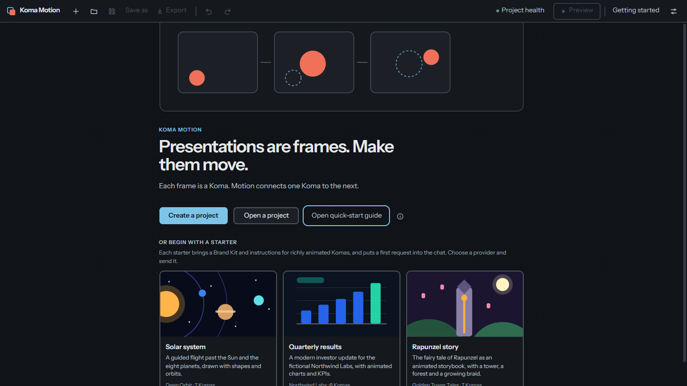
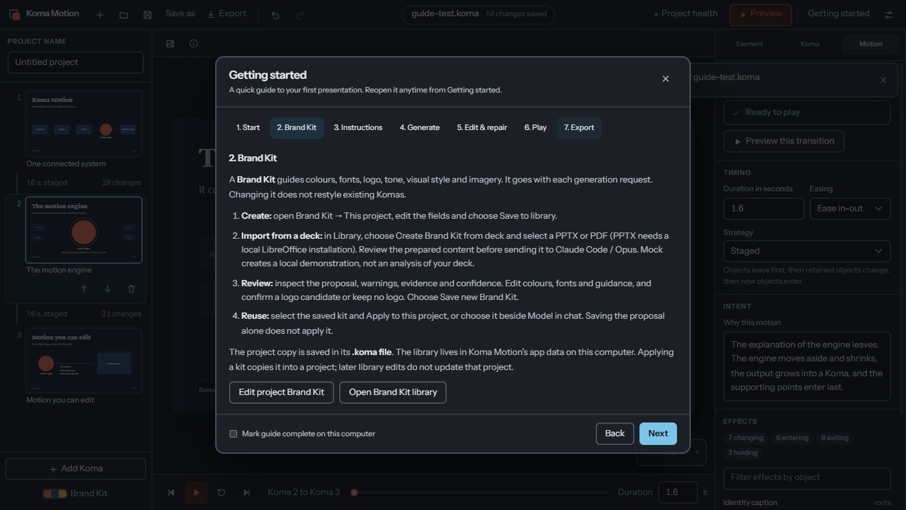
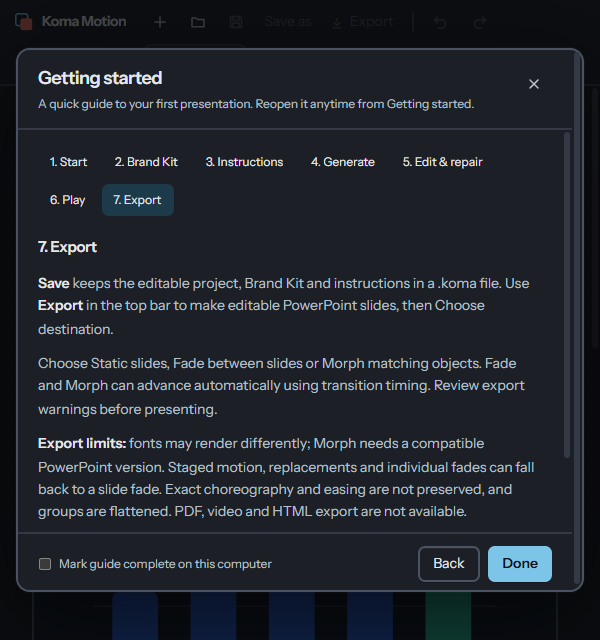

# Quick-start guide verification

Application source revision: `5e629d251a7e4d22cbb5250ca26f9f1d08cad6d1`.
The checks ran on this exact application source tree before committing it.
Later changes add the report and screenshots and move the Welcome capture
after the first guide dismissal, when the native window has finished painting.
The focused guide suite passed again after that capture-only test adjustment.

Base: `origin/main` at `89be0a5917f49ff31d8b6850e247eda74e78b48c`.
Task worktree: `D:/Code/KomaMotion-worktrees/quick-start-guide`, branch
`feat/quick-start-guide`. The main checkout remained on `main`, with its
pre-existing README and install-script changes untouched.

Platform: Windows build 26200, Node 24.18.0, pnpm 11.25.0. Each Electron test
used an isolated app profile and the built application, with mock generation.
No `KOMA_LIVE_*` variables were set.

## Results

| Check                            | Result                                                   |
| -------------------------------- | -------------------------------------------------------- |
| `pnpm install --frozen-lockfile` | Passed in the task worktree                              |
| `pnpm format:check`              | Passed                                                   |
| `pnpm lint`                      | Passed                                                   |
| `pnpm typecheck`                 | Passed                                                   |
| `pnpm test`                      | 931 unit tests passed, 6 skipped; 13 script tests passed |
| `pnpm build`                     | Passed; existing bundle-size advisory remains            |
| Electron command below           | 60 passed, 2 skipped                                     |

```powershell
pnpm --filter @koma-motion/desktop exec playwright test quickStart.spec.ts workflow.spec.ts settings.spec.ts instructions.spec.ts starters.spec.ts brandKitLibrary.spec.ts deckBrandKit.spec.ts composer.spec.ts canvas-editing.spec.ts inspector.spec.ts transitionWarnings.spec.ts preview-identity.spec.ts export-references.spec.ts --output=D:/Code/KomaMotion-evidence/quick-start-guide/regression
```

The new guide tests verify:

- No automatic opening, keyboard entry from Welcome, all seven sections,
  Back/Next/Done, Escape and close-button dismissal, focus restoration and
  reopening at the previous section.
- Native modal focus containment, named headings/navigation, disabled actions
  with no project, and scrolling without horizontal overflow at 600 × 640.
- Links to the actual Brand Kit editor/library, instructions, templates,
  provider/model settings, chat, canvas, Motion tab, preview controls and Export.
- Mock generation, transition playback and opening the real export dialog.
- Completion survives a new Electron process using the same isolated profile;
  it can be cleared and never forces the guide to open.
- Completion leaves the project clean and the saved `.koma` bytes unchanged.
- No renderer errors in the exercised guide paths.

Existing regression assertions were not changed. They cover library reuse,
PDF-to-Brand-Kit proposal review/save/apply, starters, templates, model choices,
canvas and Inspector editing, local motion recalculation, mock regeneration,
preview identity, project save/reopen and editable PowerPoint output.

## Limits and skips

The two Electron skips require a configured LibreOffice executable: PPTX deck
preparation/review and shutdown during conversion. PDF preparation and mock
proposal review passed. The six unit skips are four opt-in live-provider tests
and two Unix-only checks. No live provider generation, macOS run, manual screen
reader session, or PowerPoint application rendering was tested.

Native file dialogs are stubbed; IPC and actual file handling after selection
are exercised. Keyboard/focus/semantic checks are not a screen-reader test.
The guide accurately identifies the absent full-presentation player and the
current export limitations; it does not add playback or export features.

The initial focused run caught a test timing error: Escape was sent while
Export was still validating. The test now waits for Choose destination to be
enabled. Both subsequent focused tests and the full regression run passed.
Initial failure evidence and later run output remain outside the worktree at
`D:/Code/KomaMotion-evidence/quick-start-guide/`.

## Screenshots

Screenshots come from the built native Electron application and are saved at
CSS-pixel scale. Normal windows use the system motion preference; the narrow
run explicitly emulates reduced motion. Dimensions below are observed native
content sizes, not requested sizes.

Welcome entry point, 1448 × 816:



Brand Kit walkthrough over an open project, 1448 × 816:



Export section at 600 × 640, reduced motion enabled:


